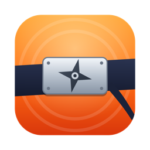

<p align="center">
  
</p>

<h1 align="center">Shinobi Launcher</h1>

<p align="center">
  <b>Play Naruto Online on your Mac.</b><br>
  An unofficial, free and open-source macOS launcher for the Flash MMO <i>Naruto Online</i> —
  with the real Adobe Flash Player, one-click start and quality-of-life extras.
</p>

<p align="center">
  <a href="https://github.com/kenoleeee/shinobi-launcher/releases/latest"></a>
  
  
  <a href="LICENSE"></a>
</p>

---

Naruto Online still runs on Adobe Flash, which no modern browser supports, and the official
launcher is Windows-only. Emulators such as Ruffle can't run the game yet (it stops loading at
about 17%). Shinobi Launcher runs the game with the **real Flash Player** instead, so it works
the way it did on Windows.

## Features

- 🎮 **Real Flash Player.** The game runs on the real Adobe Flash Player 32, not an emulator.
- 🚀 **One click to play.** Reopens the server you played last, straight into the game.
- 🔐 **Stays signed in.** Your login is kept for 30 days, and Google sign-in works too.
- 👥 **Multiple accounts.** Each account opens in its own window, e.g. your main and an alt at the same time.
- 🖥 **Clean mode.** Hides the website bar so the game fills the whole window or screen.
- ⚡ **Faster loading.** A 2 GB persistent game cache, and ads and trackers are blocked.
- 😴 **Keep awake.** Your Mac won't sleep while a game window is open, handy for AFK farming.
- 📸 **Hotkeys.** Screenshots go straight to *Pictures → Naruto Online*, and one key mutes the sound.
- 🩹 **Fixes a common hang.** Loading no longer gets stuck at 14–15% when the game picks an unreachable backup server.
- 🔄 **Update notifications** when a new version is released.

## Install

1. Download **`Shinobi-Launcher-x.y.z.dmg`** from the [latest release](https://github.com/kenoleeee/shinobi-launcher/releases/latest).
2. Open it and drag **Shinobi Launcher** into **Applications**.
3. Open Shinobi Launcher. The first time, macOS will block it because it isn't from the App Store:
   - Open **System Settings → Privacy & Security**, scroll down and click **Open Anyway** next to *Shinobi Launcher*.
   - Or run this once in Terminal:
     ```sh
     xattr -dr com.apple.quarantine "/Applications/Shinobi Launcher.app"
     ```
4. **Apple Silicon (M1/M2/M3/M4):** if macOS asks to install **Rosetta**, click *Install*.
   Adobe never made Flash for Apple chips, so Rosetta is required.
5. On the first run the launcher downloads Flash Player (about 20 MB), which takes about a minute.
   After that the game opens.

**Requirements:** macOS 11 Big Sur or newer, on Apple Silicon or Intel.

## Using it

| Action | Where / shortcut |
|---|---|
| Sign in with Google (or email) | **Account → Sign In with Google / Email…** · `⌘⇧L` |
| Add a second account (new window) | **Account → Add Another Account** · `⌘⇧N` |
| Switch between accounts | `⌘1`, `⌘2`, … |
| Back to the server list | `⌘H` |
| Screenshot | `⌘⇧S` |
| Mute / unmute | `⌘⇧M` |
| Clean mode on/off | `⌘⇧C` |
| Full screen | `⌃⌘F` |

Signing in with email and password works directly on the game's website. **Google sign-in** is
blocked by Google inside Flash-capable browsers, so use **Account → Sign In with Google / Email…**.
It opens a small Safari-based window, and once you're signed in it closes and the launcher logs you in.

## How Flash is handled

Adobe Flash Player may not be redistributed, so **it is not included in this app or this repository.**
On first launch the launcher:

1. Downloads Adobe's own *Flash Player 32.0.0.330 for Mac* installer from the
   [Internet Archive mirror of Adobe's official Flash Player archive](https://archive.org/details/fp_32.0.0.330_archive).
2. Checks its SHA-256 against the known Adobe release.
3. Checks that the installer package is signed by **Adobe Systems, Inc. (JQ525L2MZD)**.
4. Unpacks only the browser plugin into `~/Library/Application Support/Shinobi Launcher/`.
   Nothing is installed system-wide.
5. Verifies the plugin's code signature, which must also be Adobe's.

The code for this is in [`src/flash-setup.js`](src/flash-setup.js).

## Security notes

Flash Player 32 is no longer patched by Adobe. To keep it contained:

- The launcher only opens the game's websites and the Google/Facebook login pages. Any other link opens in your normal browser.
- Flash exists only inside this launcher, so none of your browsers get Flash.
- The launcher collects no data. Its debug log is local and never records passwords or login tokens.

## Troubleshooting

<details>
<summary><b>“Shinobi Launcher is damaged / can't be opened”</b></summary>

macOS quarantine blocks apps downloaded outside the App Store. Run:

```sh
xattr -dr com.apple.quarantine "/Applications/Shinobi Launcher.app"
```
</details>

<details>
<summary><b>Clicking Login does nothing / “The login server is temporarily limiting attempts”</b></summary>

After too many login attempts in a row, the game's login server blocks your IP for about 5 minutes.
Wait, then press **Login** once.
</details>

<details>
<summary><b>Black screen or the game won't load</b></summary>

Try **Game → Force Reload**. If that doesn't help, open **Help → Open Debug Log** and attach the
log to a [new issue](https://github.com/kenoleeee/shinobi-launcher/issues/new/choose).
</details>

<details>
<summary><b>First-time setup failed</b></summary>

The Flash download needs internet access to `archive.org`. Click **Try again**. If it keeps failing,
[open an issue](https://github.com/kenoleeee/shinobi-launcher/issues/new/choose) and include the
error message.
</details>

## Building from source

Requirements: macOS, Node.js 18+ and the Xcode command-line tools (`xcode-select --install`).

```sh
git clone https://github.com/kenoleeee/shinobi-launcher.git
cd shinobi-launcher
npm install          # installs the x86_64 Electron 11 (see .npmrc)
npm run build:helper # builds the sign-in helper
npm start            # run from source
npm run dist         # → dist/Shinobi-Launcher-<version>.dmg
```

Releases are built automatically by GitHub Actions when a `v*` tag is pushed
(see [`.github/workflows/release.yml`](.github/workflows/release.yml)).

**Project layout**

```
src/main.js          app, windows, accounts, menus, fixes
src/flash-setup.js   first-run Flash download + verification
src/discord.js       optional Discord status (Rich Presence)
src/config.js        repo, Discord app ID, donation links
helper/              Swift/WebKit sign-in helper
scripts/             build, package and DMG scripts
build/               app icon
```

## Support the project

Shinobi Launcher is free and always will be. If it brought Naruto Online back to your Mac, you can
support its development:

| Coin | Address |
|---|---|
| **ETH / ERC-20** (USDT, USDC) | `0x92277bbeb48218dee7e6fc1248a1cfa768d83850` |
| **BTC** | `1Nsq5PtU8YueBTxpRWXo1BUvihyaRLuaG4` |

⚠️ Send ERC-20 tokens **only on the Ethereum network** to the ETH address, and only BTC to the BTC address.
You can also find these addresses in the app under **Help → Support the Project**.

A ⭐ on GitHub helps too!

## Disclaimer

Shinobi Launcher is an **unofficial fan project**. It is not affiliated with, endorsed by or
connected to Oasis Games, Mars Era, Tencent, Bandai Namco, Masashi Kishimoto / Shueisha, or Adobe.
*Naruto* and *Naruto Online* are trademarks of their respective owners. Adobe Flash Player is
© Adobe and is downloaded from Adobe's own installer at first run. It is not distributed here.

The launcher doesn't change the game, give gameplay advantages or automate play. It only lets the
official game run on macOS.

## License

[MIT](LICENSE) © 2026 kenoleeee
